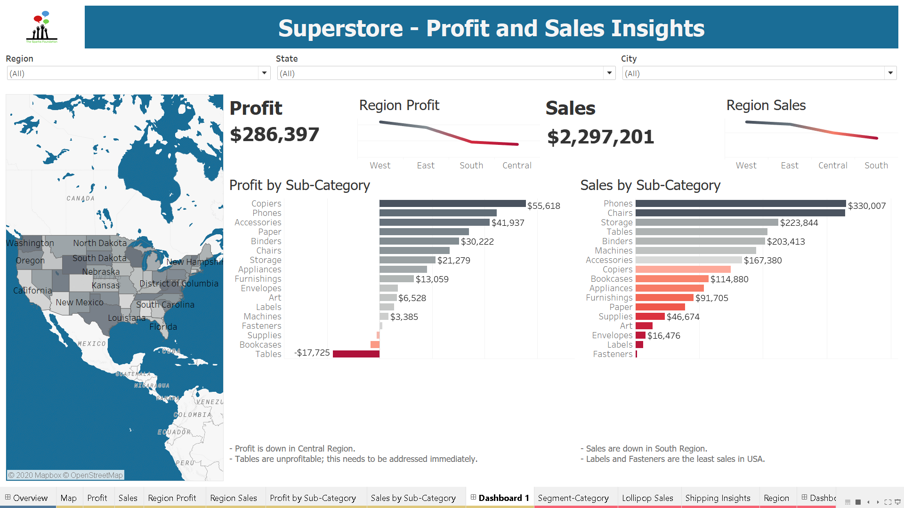
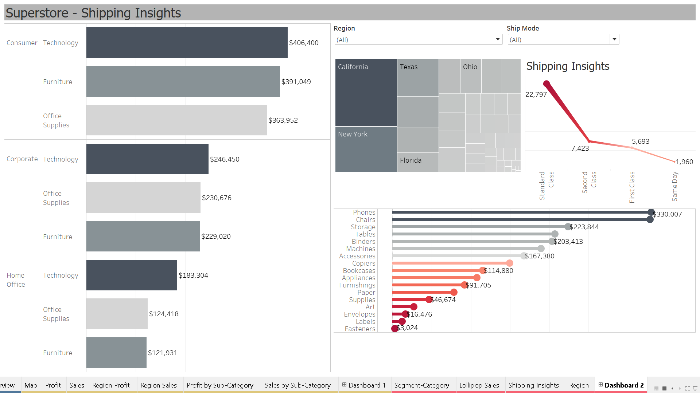

# TheSparkFoundation
Data Science Internship - GitHub Repository
## Task 2
Linear Regression 
Tools: Jupyter Notebook 
Libraries: Scikit-learn, Pandas, Numpy, Plotly, Matplotlib 

## Task 5
Explore Business Analytics 
Tools: Tableau 
Dataset: Sample Superstore 

### Dashboard 1

### Dashboard 2

